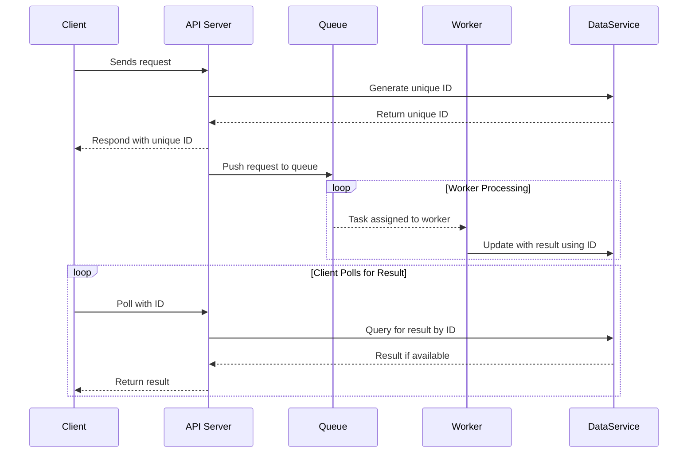
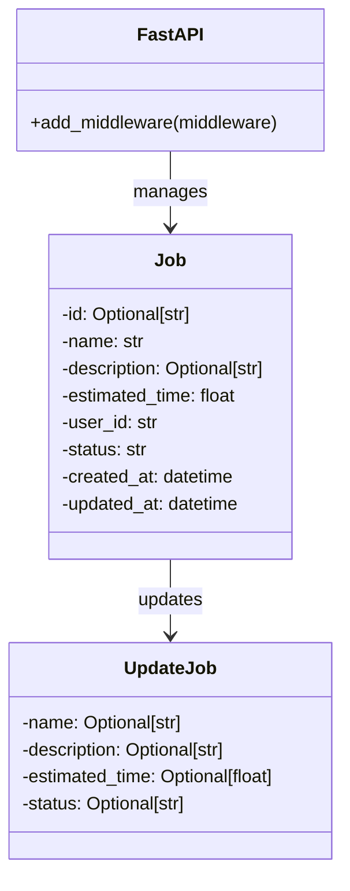
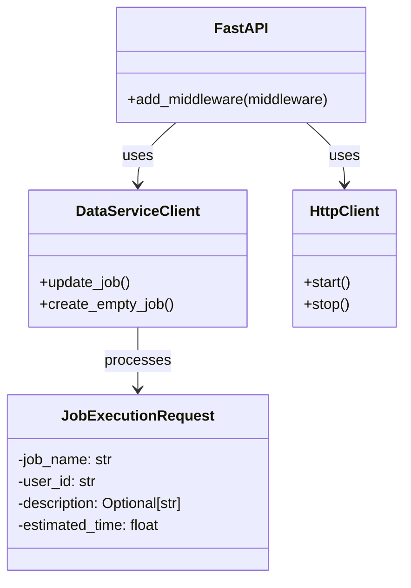
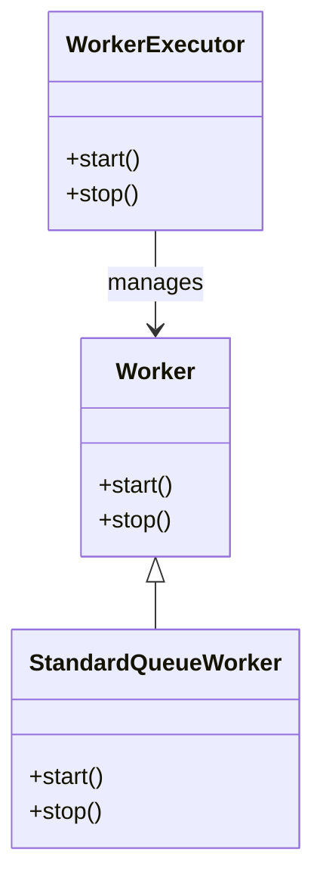

# Distributed Task Processing System

The Distributed Task Processing System is designed to efficiently process and manage tasks across distributed systems, leveraging the power of containerized services for scalability and flexibility. This system integrates a backend API, a data service, worker services for task processing, and an Angular-based front-end application for user interaction.

## Prerequisites

Before you begin, ensure you have met the following requirements:
- Docker and Docker Compose
- Kubernetes CLI (kubectl) for Kubernetes deployment
- Node.js and npm for Angular development
- Angular CLI for managing the Angular project

## Setup and Local Development

This section guides you through getting a development environment running.

### Backend and Services

#### Environment Setup

First, make sure to configure the `.env` file according to the template provided in the repository. The file should include the following environment variables:

- `STANDARD_QUEUE_NAME`
- `DATA_SERVICE_URL`
- `MONGODB_URL`
- `DATABASE_NAME`
- `COLLECTION_NAME`
- `AWS_ACCESS_KEY_ID`
- `AWS_SECRET_ACCESS_KEY`
- `AWS_DEFAULT_REGION`

#### Running with Docker Compose

To start all backend services and the worker, navigate to the backend directory and run:

```
docker-compose up --build
```
### Frontend Setup (Angular)

**Installing Dependencies:** Navigate to frontend directory and install the required dependencies by running `npm install`

**Running Development Server:** Launch the development server with `npm run start`

Access the Frontend application by navigating to http://localhost:4200/.

### Deployment

#### Backend Services and Worker Deployment
For deploying your backend services and workers to a Kubernetes cluster, ensure you have built the Docker images and pushed them to your container registry.

**Kubernetes Deployment:** Adjust the Kubernetes deployment.yaml files with your specific configurations, including the Docker image paths. Apply these configurations to your cluster with:

```
kubectl apply -f kubernetes/*.deployment.yaml
```

## System Workflow



## ClassDiagram(Dataservice)



## ClassDiagram(Kernel)

## ClassDiagram(Worker)



## Kernel API Endpoint Table
| Method | Endpoint                | Description                             | Request Body         | Query Parameters | Response              |
|--------|-------------------------|-----------------------------------------|----------------------|------------------|-----------------------|
| POST   | `/api/v1/job_executor/async`    | Initiates the asynchronous execution of a job      | `JobExecutionRequest`   | `executor` (optional)   | `{status: 200, job_id: <job_id>}` |


## Dataservice API Endpoint Table
| Method | Endpoint                | Description                             | Request Body         | Query Parameters | Response              |
|--------|-------------------------|-----------------------------------------|----------------------|------------------|-----------------------|
| POST   | `/job/`                 | Create a new job                        | `Job`                | N/A              | `{"id": <new_job_id>}`|
| GET    | `/job/{user_id}`        | Retrieve all jobs for a specific user   | N/A                  | N/A              | `[Job]`               |
| GET    | `/job/{job_id}`         | Retrieve a specific job by its ID       | N/A                  | N/A              | `Job`                 |
| PUT    | `/job/{job_id}`         | Update a job by its ID                  | `UpdateJob`          | N/A              | `UpdateJob`           |
| DELETE | `/jobs/{job_id}`        | Delete a job by its ID                  | N/A                  | N/A              | `{"message": "Job <job_id> deleted."}` |
